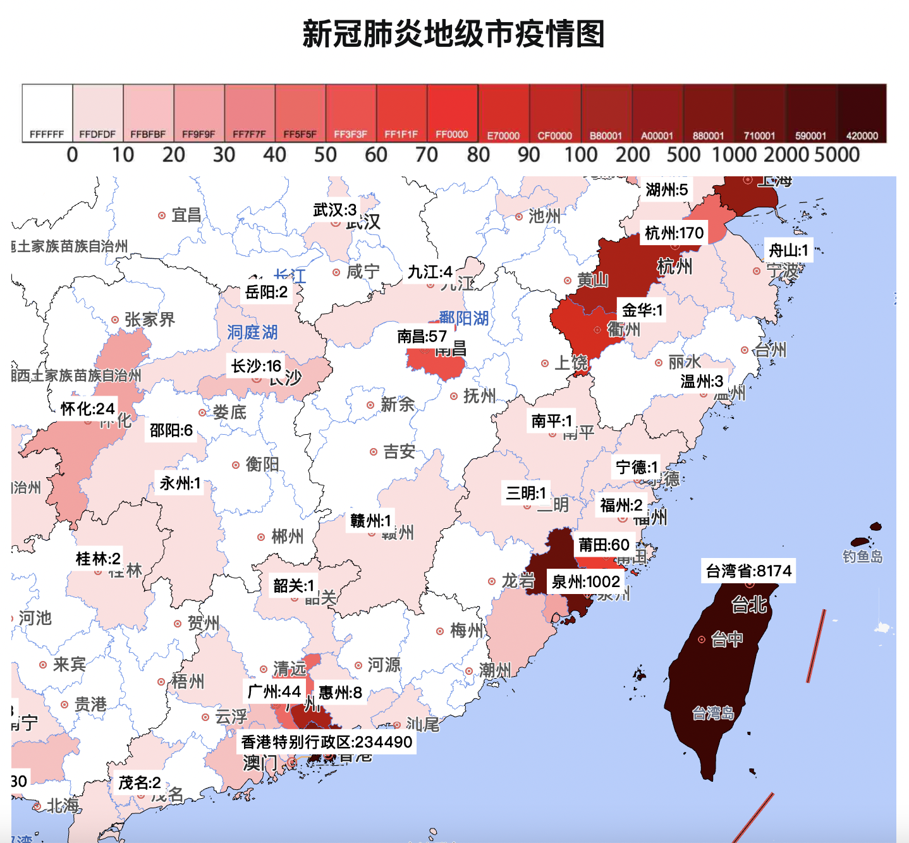

# 中国新型冠状病毒肺炎疫情地级市图


## 使用说明

点击地图可以显示每个城市的具体病例确认数。

### 方式一（推荐）：直接网页访问
本项目已经部署在 Github Pages 上了。可以直接访问 [这里](https://lispczz.github.io/pneumonia/)。每五分钟自动更新。

### 方式二：自己手动生成 

```bash
python3 generate_data.py # 这一步会从腾讯新闻疫情网页上获得地级市的疫情确认数，之后写入到 confirmed_data.js
open index.html # 使用高德地图 API 画图，使用了上一步中的获得的数据
```

## 注意事项
* 目前没有处理疑似病例
* 北京，上海，天津不细分区县

## 现有问题

* 部分行政区划在高德地图中过时了，导致绘图不正确。例如山东省莱芜市已经合并进济南，变成了济南市莱芜区。但是高德地图上济南染色时没有包含莱芜区，因此莱芜看起来是没有病例的白色。
* 少数城市显示病例数时，城市名最开始一两个字会丢失，例如应当显示“忻州市 2”，显示的是“州市 2”。原因不明。

## 效果



