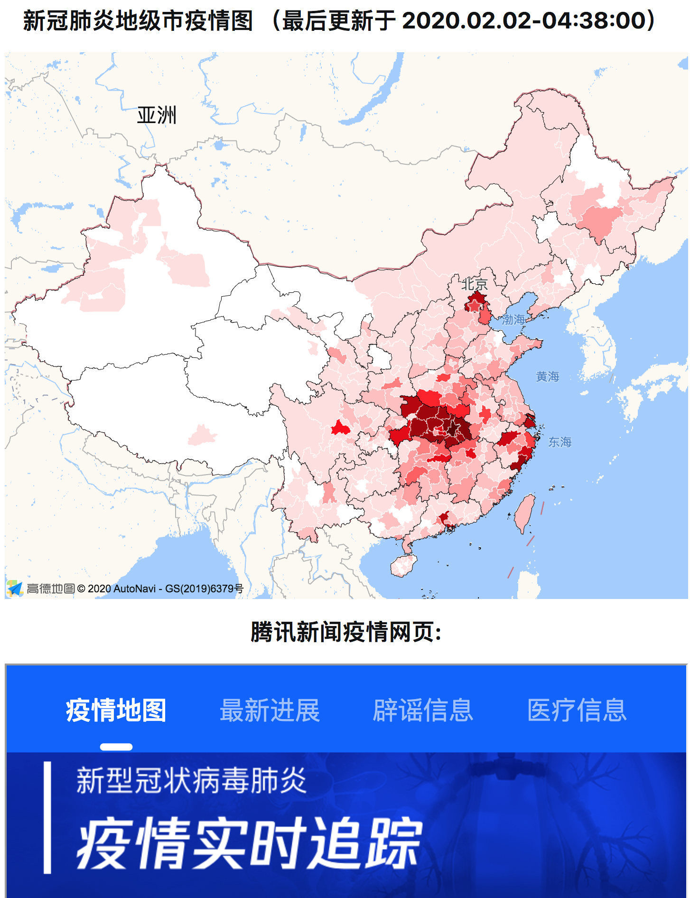

# 中国新型冠状病毒肺炎疫情地级市图

在网页上通过新浪新闻的 API 获得 __现存__ 病例数，在高德地图上给每个城市绘制不同颜色。    
点击地图可以显示每个城市的具体数字。

## 使用说明

### 方式一（推荐）：直接网页访问
本项目已经部署在 Github Pages 上了。可以直接访问 [这里](https://lispc.github.io/covid19-citymap-china/)。

### 方式二：自己手动生成 

```bash
# 可以直接访问
$ yarn webpack serve
# 或者打包后使用静态文件服务器 host
$ yarn webpack
```

## 注意事项
* 北京，上海，天津不细分区县

## 离线数据获取工具

```bash
# 可以使用下面的命令直接 print 每个城市的病例数
$ ts-node src/load_data.ts
```


## 效果



